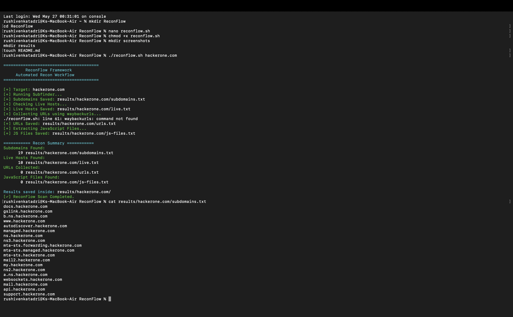
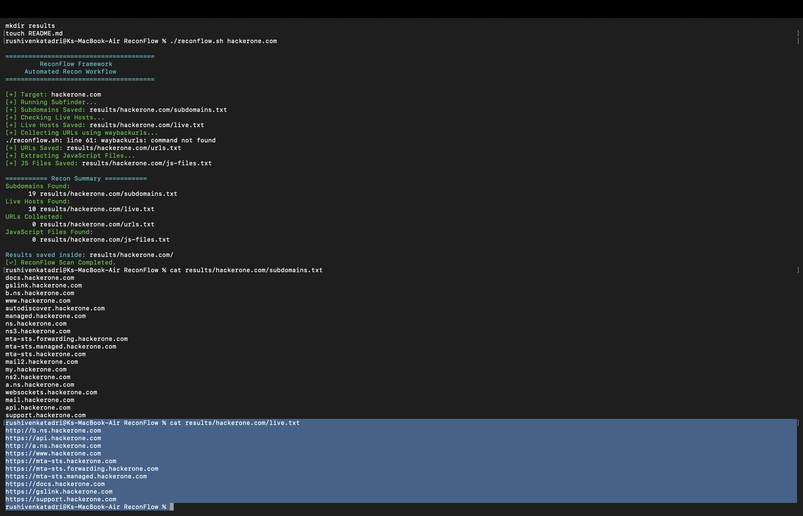
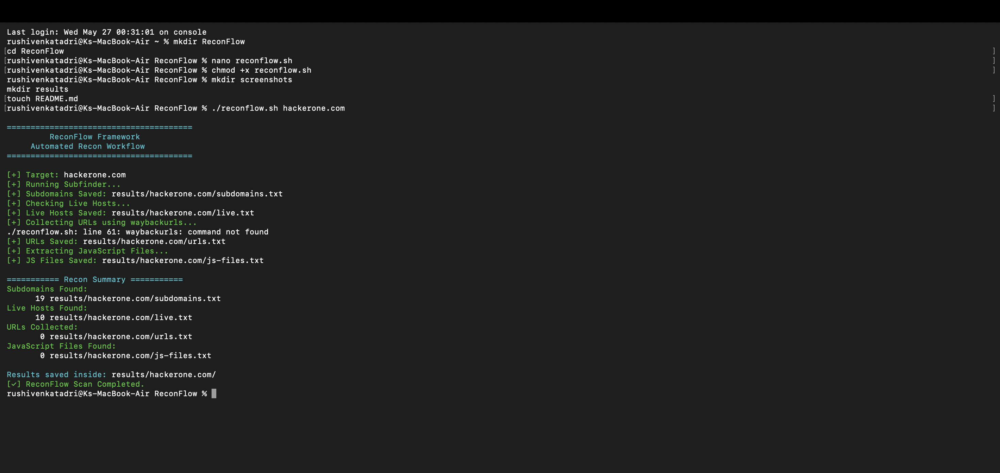

# ReconFlow 🔍

ReconFlow is a beginner-friendly Reconnaissance Automation Framework built for Web Security and Bug Bounty learning.

## Features

- Subdomain Enumeration
- Live Host Discovery
- URL Collection
- JavaScript File Extraction
- Organized Result Storage

## Tools Used

- subfinder
- httpx
- waybackurls
- Bash Scripting
- Linux

## Usage

```bash
./reconflow.sh target.com
```

## Workflow

1. Find subdomains
2. Check live hosts
3. Collect URLs
4. Extract JS files
5. Save organized results

## Screenshots

### Recon Workflow


### Live Host Discovery


### Results Folder


## Educational Purpose

This project is created for:
- Cybersecurity learning
- Bug bounty methodology practice
- Reconnaissance workflow understanding
- Authorized security testing only
